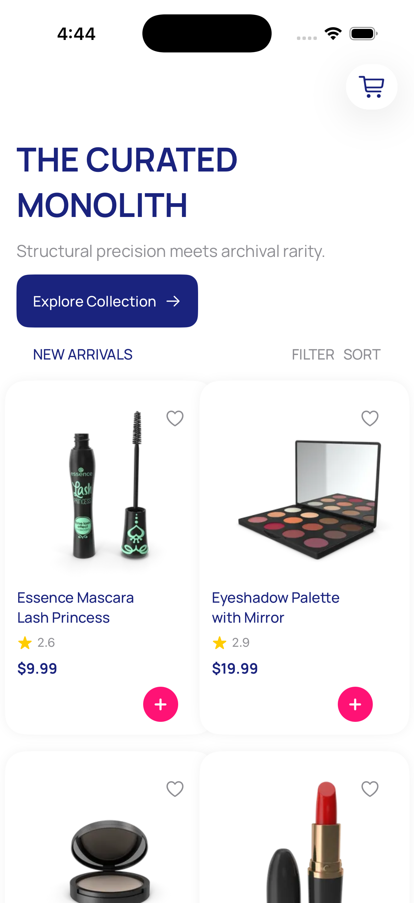
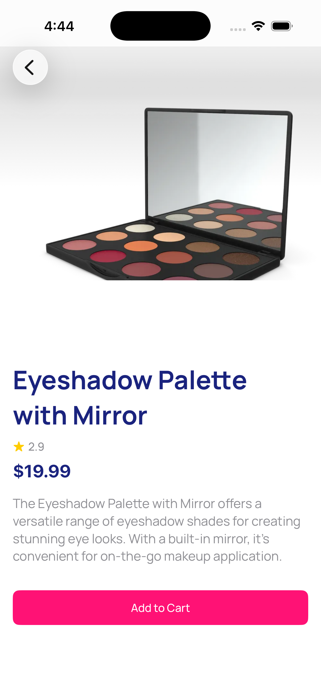
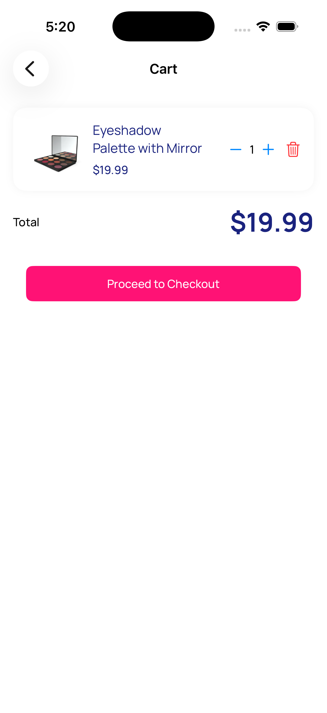
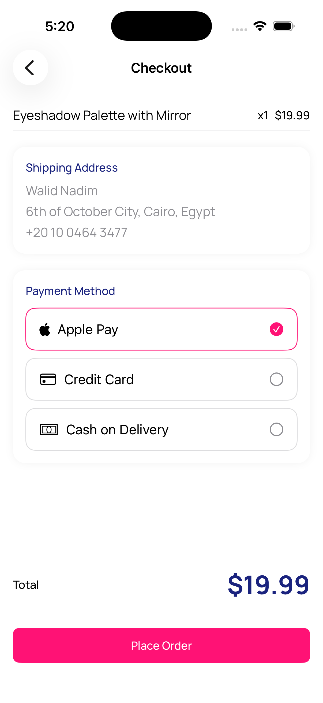

# 🛍️ SwiftUI E-Commerce App

A modern iOS e-commerce application built with SwiftUI, showcasing a complete shopping experience from browsing products to checkout.

---

## 🎬 Demo

A smooth shopping experience with real-time cart updates, persistence, and modern SwiftUI animations.

---

## 🚀 Features

- 🏠 Home screen with product listing (API integration)
- 🔍 Product details view with image carousel
- 🛒 Advanced cart management (add/remove/update with persistence)
- 💾 Cart persistence using UserDefaults
- 💳 Checkout flow with payment selection
- ✅ Order confirmation screen
- 🔔 Haptic feedback and animations
- ⚡ Skeleton loading and responsive UI

---

## 🧱 Architecture

- MVVM (Model-View-ViewModel)
- SwiftUI + Combine
- Async/Await networking

---

## 🛠️ Tech Stack

- SwiftUI
- URLSession (API)
- UserDefaults (local persistence)
- EnvironmentObject (state management)

---

## ⭐ Key Highlights

- Clean MVVM architecture
- Smooth animations and transitions
- Persistent cart using UserDefaults
- Reusable UI components
- Modern SwiftUI navigation (NavigationStack)

---

## 📸 Screenshots

| Home | Product |
|------|--------|
|  |  |

| Cart | Checkout |
|------|----------|
|  |  |

---

## 🎯 What I Learned

- Building scalable SwiftUI apps
- Managing app-wide state
- Implementing smooth UX interactions
- Handling navigation with NavigationStack
- Creating reusable components

---

## 📦 Future Improvements

- Firebase Authentication
- Real payment integration (Stripe)
- Backend API integration
- Wishlist feature

---

## 👨‍💻 Author

Walid Nadim  
iOS Developer
